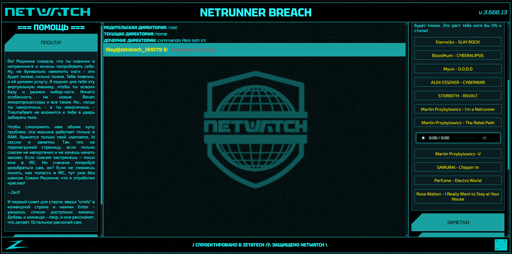
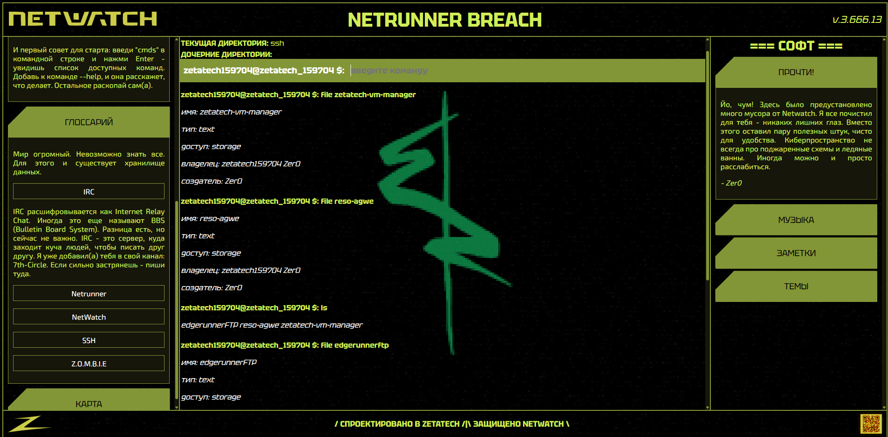

# Netrunner Breach

Интерактивная браузерная игра в стиле cyberpunk-терминала.  
Ты играешь за начинающего нетраннера, исследуешь виртуальную файловую систему, подключаешься к удаленным узлам и принимаешь решения, которые влияют на исход.

## Что это за игра

- Жанр: текстовый квест/терминальный симулятор с сюжетными развилками.
- Формат: одиночная сессия в браузере.
- Интерфейс: псевдо-OS с командами (`ls`, `cd`, `cat`, `ssh`, `irc`, `scp`, `steghide` и др.).
- Атмосфера: cyberpunk 2077-эстетика, тематические темы интерфейса и встроенная музыка.

## Важно перед началом

Игра работает в оперативной памяти (RAM-like сессия):

- не перезагружай страницу во время прохождения;
- не закрывай вкладку, если хочешь продолжить текущую попытку;
- после перезагрузки прогресс можно потерять.

Коротко: **запустил - прошёл за одну сессию**.

## Быстрый старт для игроков

1. Введи ник при запуске.
2. В терминале сначала набери `cmds`.
3. Используй `--help` для команд, например: `scp --help`.
4. Изучай `files`, `ssh`, `irc` директории и читай содержимое через `cat`.
5. Следи за подсказками в панели `=== ПОМОЩЬ ===` и в IRC.

## Базовые команды

- `cmds` — список доступных команд.
- `ls` — показать содержимое текущей директории (файлы и папки).
- `cd <директория>` — перейти в директорию (`cd ..` назад).
- `cat <файл>` — прочитать файл.
- `file <файл>` — метаданные файла.
- `steghide <файл>` — скрытые данные из файла (если есть).
- `ssh <ip>` — подключиться к удаленному узлу.
- `irc <ip>` — войти в IRC-клиент.
- `scp <файл> <ip> <пароль>` — отправить файл на удаленный сервер.
- `toggle <элемент>` — скрыть/показать элементы интерфейса.

## Безспойлерные подсказки

- Не спеши с `scp`: сначала изучи контекст и все намеки.
- Если кажется, что “ничего не работает”, проверь скрытые данные в релевантных файлах.
- IRC не просто “чат для атмосферы” — там есть важные подсказки.
- Не игнорируй разделы `ПОМОЩЬ` и `СОФТ`: они реально полезны для прохождения.
- `ls`, `cat` и `steghide` — три главных инструмента раннего прогресса.

## Особенности интерфейса

- Темы оформления можно переключать в `=== СОФТ ===`.
- Элементы UI стилизованы под выбранную тему.
- Музыкальные треки встроены локально в игру.

## Скриншоты

### Интерфейс в стиле NetWatch



### Альтернативная тема интерфейса



## Технический стек

- **TypeScript**
- **React 18**
- **React Router**
- **SCSS (Sass)**
- Create React App (`react-scripts`)

## Запуск проекта локально

```bash
npm install
npm start
```

Сборка production:

```bash
npm run build
```

Тесты:

```bash
npm test
```

## Для разработчиков

- Основная логика терминала: `src/components/terminal.tsx`
- SSH/IRC экраны: `src/components/sshTerminal.tsx`, `src/components/ircTerminal.tsx`
- Игровые данные/мир: `src/data/*`
- Парсинг команд: `src/functions/cmdParser.ts`

Если добавляешь новый сюжетный контент, старайся:

- держать безспойлерную подачу в UI;
- добавлять подсказки через окружение (файлы, IRC, скрытые сообщения), а не прямые ответы;
- проверять, что сценарий проходим без перезагрузки страницы.

Special thanks to original unmaintained project of TaureHorn

